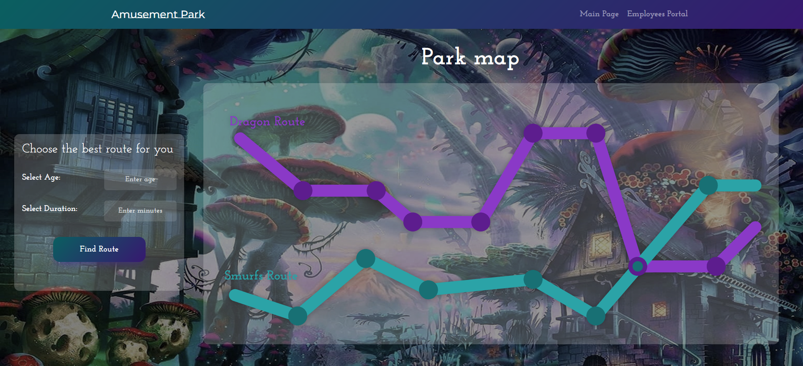
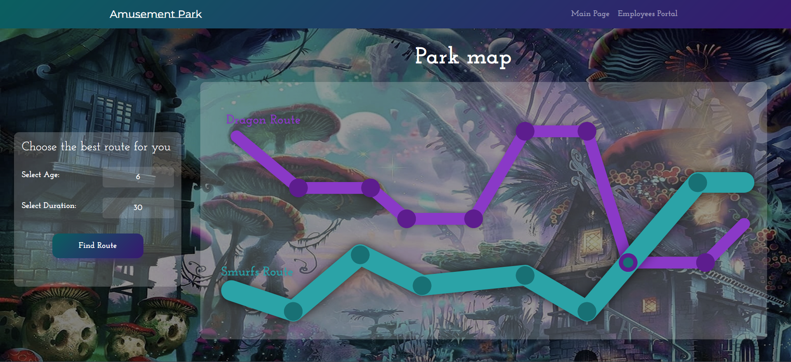
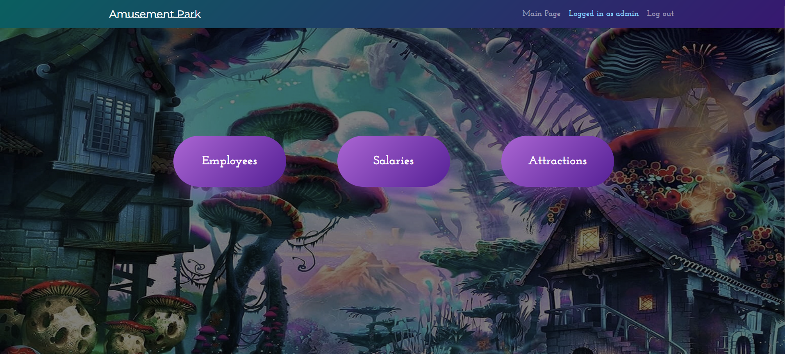
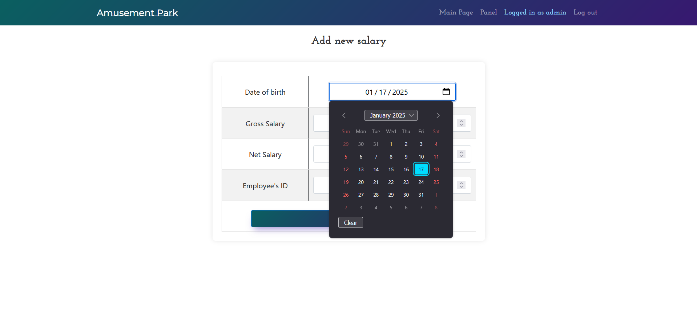

# Amusement Park Web App
This repository contains the source code for the Amusement Park Web Application, developed using the Spring Framework in Java. The application allows administrators to manage amusement park employees, attractions, and salary information, while regular users can explore the park's map and plan their visit.

## Features
### User Experience:
- **Interactive Park Map:** Displays two routes: **Dragon Route** and **Smurfs Route**
  - Hover over attraction points to see descriptions
  - Filter attractions based on age and available time, highlighting the best-suited route

- **User Dashboard:**
  - Access general amusement park information
  - Option to log in as an admin

### Admin Management:
- **Employee Management:**
  - View, add, edit, and delete employees
- **Salary Management:**
  - View, add, edit, and delete salary records
- **Attraction Management:**
  - View and edit
 
## Enhanced UI/UX:
- Animated navigation bar, buttons, and interactive elements
- Smooth animations for route highlighting and attraction details

## Technologies Used:
- **Spring Framework** – Core backend framework
- **Spring MVC** – Implements Model-View-Controller architecture
- **Spring JDBC** – Handles database interactions
- **Thymeleaf** – Server-side Java template engine for dynamic web content
- **Supabase** – Cloud-hosted PostgreSQL database for storing park data
- **HTML, CSS, JavaScript** – Frontend development
- **Java Database Connectivity (JDBC)** – Ensures seamless database connection

## Database Structure
The application uses a Supabase-hosted PostgreSQL database with tables for:
- Pracownicy (Employees)
- Wynagrodzenia (Salaries)
- Atrakcje (Attractions)
  
Refer to the DAO (Data Access Object) classes for detailed database interactions.

## Getting Started
- To run the application locally, follow these steps:
- Clone the repository by copying this code:
```bash
git clone https://github.com/Patr1ckf/AmusementPark.git
```
- Open the project in your preferred Java IDE
- Build and run the application
- Access the application in your web browser: http://localhost:8080

## Usage
- Navigate to the various pages using the provided URLs:
  - `/index`: Home page
  - `/main_admin`: Admin dashboard for managing employees, salaries, and attractions
  - `/login`: Login page (authentication not yet implemented in this version)
- Perform CRUD operations on employees, salary records, and attractions using the respective pages
- In order to access the admin side and manage data press `Employees portal`

## Screenshots
Take a look at the Amusement Park Web App's UI and key features!











